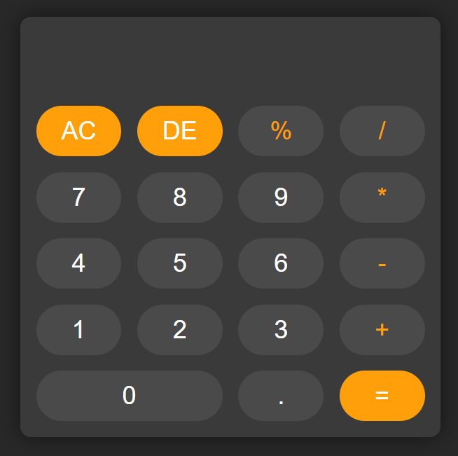

# 🧮 Calculator App
- [Live](https://calculator-pintu-jenas-projects.vercel.app/)
- [Code](https://github.com/CAP10D/calculator.git)

A simple and stylish calculator built with **HTML, CSS, and JavaScript**.  
This project demonstrates basic **DOM manipulation**, **event handling**, and **error handling** using `try...catch`.

---

## 🚀 Features
- Dark themed modern UI
- Basic arithmetic operations: `+`, `-`, `*`, `/`
- Decimal support
- Clear button (`AC`) to reset the input
- Delete button (`DE`) to delete one by one.
- Error handling for invalid expressions
- Responsive design for all screen sizes

---

## 📸 Preview
  
*(You can replace this image with your own screenshot.)*

---

## 🛠️ Tech Stack
- **HTML5** – Structure  
- **CSS3** – Styling & Layout (Flexbox + Grid)  
- **JavaScript (Vanilla)** – Functionality  

